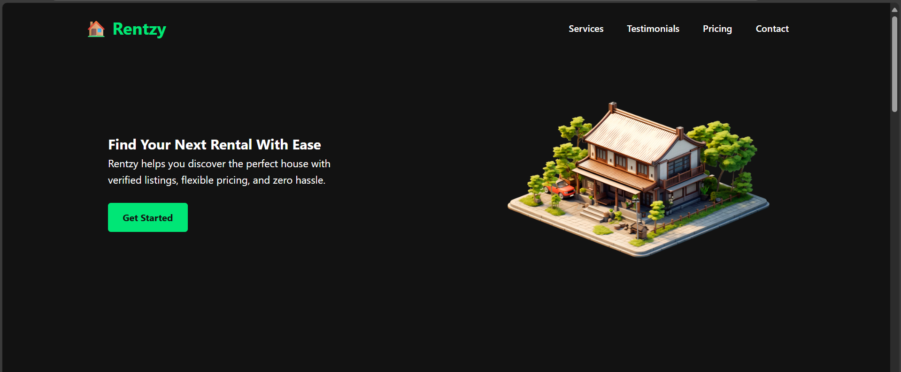
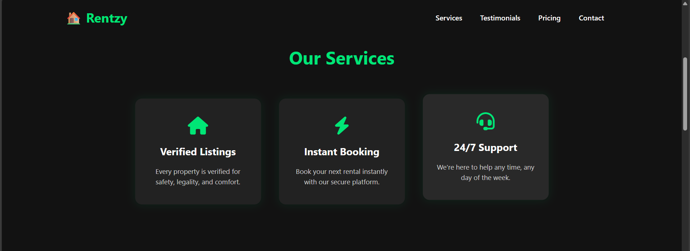
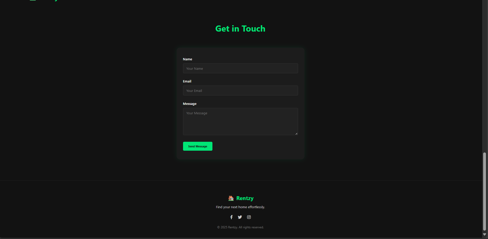

---

### ✅ `README.md`

````markdown
# 🏠 Rentzy - Responsive Dark-Themed Landing Page

Rentzy is a modern, responsive landing page for a fictional house rental service. It’s built using clean HTML and CSS with a sleek dark theme and consistent UI components — perfect for practicing frontend skills or showcasing your portfolio.

## 🌑 Live Preview
[Click here to preview](#) *(Add your GitHub Pages or Netlify link here)*

---

## 📸 Screenshots

  
  
  


---

## 📁 Features

- ✅ Sticky Navigation Bar
- ✅ Dark Theme with Consistent Styling
- ✅ Responsive Layout for All Devices
- ✅ Call-to-Action Hero Section
- ✅ Services / Features Grid
- ✅ Client Testimonials
- ✅ Modern Pricing Cards
- ✅ Contact Form UI
- ✅ Clean Minimal Footer

---

## 🛠️ Tech Stack

- HTML5
- CSS3 (No frameworks)
- Responsive Flexbox & Media Queries

---

## 📦 Folder Structure

```bash
Rentzy/
│
├── index.html
├── style.css
├── /images        # All image assets
└── /screenshots   # Optional: screenshots for README
````

## 🚀 How to Use

1. Clone the repo:

```
git clone https://github.com/yourusername/rentzy-landing-page.git
```

2. Open the project in VS Code or any editor.
3. Open `index.html` in your browser or use [Live Server](https://marketplace.visualstudio.com/items?itemName=ritwickdey.LiveServer).
4. Customize content, links, or styles as needed.
```